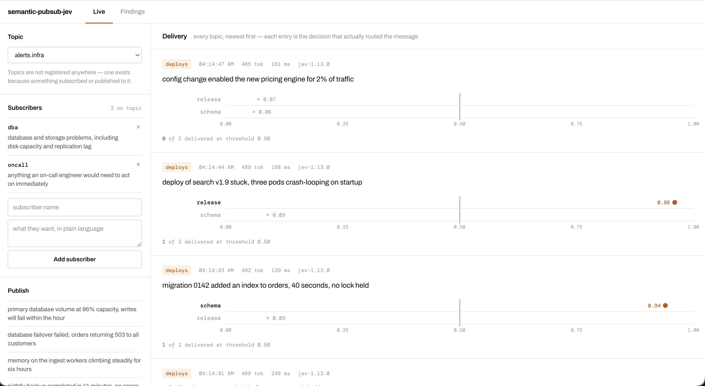

# semantic-pubsub-jev

Pub/sub that routes messages by **what they mean**, not just which topic
they were published to.

Subscribers state what they care about in plain language. Every published
message is judged once against all of a topic's stated interests, and
delivered only to the ones that matched.

```
alice: "database and storage problems, including disk capacity"
bob:   "network latency and connectivity issues"
carol: "security incidents and authentication failures"

published to topic "alerts":
  1. "primary volume at 96% capacity, writes will fail within the hour"
  2. "p99 round-trip time to eu-west up 400ms, packet loss 2%"
  3. "4,000 failed login attempts from a single ASN in 10 minutes"

delivered:
  alice <- 1        bob <- 2        carol <- 3
```

That run is real, against live [Jev](https://docs.typesafe.ai). It cost
$0.000074.



Three consecutive messages in that feed, the same two subscribers every
time, three different outcomes:

| Message | `release` | `schema` |
| --- | --- | --- |
| config change enabled the new pricing engine for 2% of traffic | 0.07 | 0.06 |
| deploy of search v1.9 stuck, three pods crash-looping | **0.96** | 0.09 |
| migration 0142 added an index to orders, 40 seconds, no lock held | 0.09 | **0.94** |

Both of the last two are deployment events on the `deploys` topic, and they
go to *different* subscribers — one watching for deploys that did not
finish cleanly, one watching for schema changes. Nothing about the words
separates them; what they mean does.

## Why this is possible now

Calling a language model per message per subscriber should be absurdly
expensive. Jev is a *System One* model: it returns typed answers with
calibrated probabilities instead of generated text, ingests the state
once and evaluates every question against it **in parallel**, and bills
only input tokens.

So one request carries the message plus every subscriber's predicate.
Measured: going from 1 to 100 predicates in a single request moved
latency from **193ms to 224ms** — near-flat. Cost is linear but small,
around **$0.30 per 1,000 publishes** at 100 subscribers.

## Status: two pass, one fails

An experiment packaged as a library. The machinery was never the
deliverable on its own — the question was whether semantic routing is
reliable enough to depend on, and "it is not" was always a permitted
answer. All three measurements have now been run.

| | | |
| --- | --- | --- |
| **M1** | Is the routing decision reproducible? | **pass** |
| **M2** | Do answers worsen as predicates per request grow? | **pass** |
| **M3** | Does phrasing decide the outcome more than the threshold? | **fail** |

- **M1 — stability.** Flip rate **0.0%** across 20 repeats, with no case
  straddling any threshold from 0.2 to 0.9. Routing is reproducible.
- **M2 — batch degradation.** **Zero decision changes** from 6 to 200
  predicates in one request. 200 subscribers judged in **327ms** for
  **$0.81 per 1,000 publishes**.
- **M3 — wording sensitivity.** **23.8%** of intents routed differently
  depending only on how they were phrased, moving answers **27.9x** more
  than the system's own noise floor.

The engineering works; the interface does not, yet. The system reliably
delivers what you asked for, and the hard part is knowing what you asked
for. Adding "excluding purely internal concerns" to a predicate moved one
case from 0.830 to 0.339 — a far stronger lever than the threshold, which
is the dial you would expect to reach for.

That is a usability failure rather than a reliability one, which makes it
tractable: the console exists so you can see what a predicate actually
catches before trusting it.

Total spend across all three experiments: **$0.064**.
Full method, numbers and caveats: [docs/measurements.md](docs/measurements.md).

## Running it

```bash
cp .env.example .env          # add TYPESAFE_API_KEY
redis-server --port 6379 --save '' --daemonize yes
go run .
```

Then open **<http://localhost:8090>**.

Without an API key it falls back to a keyword judge: deterministic, free,
and with none of the semantic behaviour that is the point — useful for
development, useless as evidence. The console says so when it happens.

## The console

Three subscribers per default topic are seeded on first run, so there is
something to route against immediately. They overlap on purpose: a failed
database failover is both a storage problem and an on-call problem, so
messages land on both, one, or neither depending on what they say.

**Live** is the working view. Pick a topic, add subscribers in plain
language, and click an example message to publish it — every subscriber on
that topic is judged in one request, and the decision that *actually routed
the message* appears in the feed. Each entry plots its subscribers on a
shared 0→1 axis with the threshold drawn through it, so who cleared the
line is a matter of looking rather than reading numbers.

Moving the threshold re-routes the whole feed instantly and costs nothing:
the scores are already recorded.

The feed spans **every topic**, not just the selected one.

**Findings** is this README's argument in longer form, with the three
measurements and what they showed. At the foot of it, **Explore** loads any
recorded run from `results/` — the full matrix of probabilities behind
M1, M2 and M3, with the same threshold slider.

### How the console gets its numbers

It observes; it does not re-judge. The judge records what it decided into a
bounded ring, and the console reads that back over server-sent events.
Judging a second time to populate a UI would double the cost and could
disagree with the decision that was actually applied.

A publish to a topic with no subscribers never reaches the judge at all, so
the console records the bare publish itself — *"no subscribers, nothing
judged"* is a different fact from *"nobody matched"*, and both are different
from the publish having failed.

| Variable | Default | |
| --- | --- | --- |
| `CONSOLE_ADDR` | `:8090` | Separate listener from the websocket port — the console exposes routing internals clients have no business reading. |
| `TOPICS` | `alerts.infra,deploys,security` | Suggestions, not a registry. Any topic you type is created by being used. |
| `SEED_SUBSCRIBERS` | `true` | Only ever writes to topics that have none. |
| `RESULTS_DIR` | `results` | Recorded runs served to Explore. |

### Protocol

Subscribe as normal, then state an interest:

```json
{ "type": "subscribe", "topic": "alerts" }
{ "type": "interest", "topic": "alerts",
  "data": { "predicate": "database and storage problems" } }
```

Interests are per connection and per topic, live in Redis so any instance
can judge a publish, and are dropped when the connection closes.

## How it fits together

The broker is [go-ws-server](https://github.com/damiensmith1/go-ws-server),
a separate project, consumed as a tagged dependency and never forked. It
is generic and knows nothing about semantics or Jev. This project supplies
four of its extension points:

| Extension point | Supplied here |
| --- | --- |
| `handler.Registry` | the `interest` verb |
| `bus.CandidateSource` | reads a topic's interests from Redis |
| `bus.Judge` | one batched Jev call per publish |
| `OnConnect` / `OnDisconnect` | TTL refresh, and cleanup |

Judging happens **once, at publish**, and the decision travels with the
message — so every instance and every replay agree. If Jev is
unavailable, routing falls back to ordinary topic delivery rather than
dropping messages.

## Docs

- [`docs/background.md`](docs/background.md) — the problem, prior art
- [`docs/requirements.md`](docs/requirements.md) — requirements, measurements, non-goals
- [`docs/design.md`](docs/design.md) — architecture, decisions and their evidence

## Tests

```bash
go test ./...                            # unit, free, no network
go test -tags=live ./internal/jev/ -v    # one real call, ~$0.000025
```

CI runs the unit tests and **compiles** the live-tagged ones without
running them — build tags are invisible to `go build` and to an untagged
`go vet`, so without an explicit tagged check a live test can quietly
stop compiling. Nothing in CI calls the real API or needs a key.

## License

[MIT](./LICENSE)
